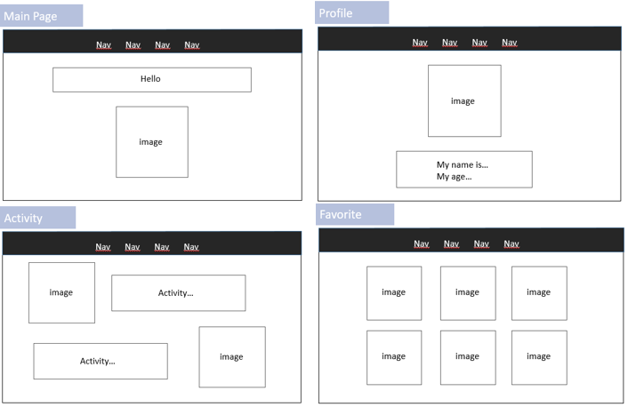

# SE_portfolio
 
일주일의 포트폴리오 제작 프로젝트!

## Introduction
> 프로젝트 시작 배경을 적어볼게요!
- 일주일간의 학습
  - `HTML`, `CSS`, `Bootstrap`을 배우고 프로젝트를 수행했습니다
  - 재밌지만 어려운, 마음대로 되는게 없는 일주일이었습니다
- __설날에 놀면 뭐하니?!__
  - 열정가득 조장님!!:fire:
  - 코앞으로 다가온 설날! 뭐라도 해보지 않겠나?
  - 그렇게 우리의 __포트폴리오 프로젝트__ 가 시작되었습니다!
  
## Goal
> 일주일 프로젝트의 목표는??
- 02/08 ~ 02/14까지 나를 소개하는 포트폴리오 웹사이트 제작하기!
- HTML, CSS, Bootstrap에 익숙해지기

## Plan
> 계획이 있어야겠죠?? 
> 넘나 빡세지만...화이팅!
  - 02/08(Mon) : 포트폴리오 초안 제작 및 공유
  - 02/09(Tue) : 전체 구조 잡기
  - 02/10(Wed) : 사진 및 전체적인 내용 구성하기
  - 02/11(Thu) : 중간점검
  - 02/12(Fri) : 깔끔하게 디자인하기
  - 02/13(Sat) : 세부사항 조정(90%완성 목표!)
  - 02/14(Sun) : 최종결과 소개

## 02/08 진행상황
> 오늘은 초안을 구성하고 스터디원들과 공유하는 시간을 가졌습니다!
- 초안

  - main page : 인사말(나는 누구일까요?), 뒷모습 이모지(클릭하면 프로필로?)
  - profile : 앞모습 이모지, 이름, 나이 등등 나에 대한 기본적인 정보
  - activity : 봉사, 인턴, 대회 등등 지난 4년간의 활동 순차적으로 정리
  - favorite : 나의 흥미, 좋아하는 사진, 영화 등등 간략하게 볼 수 있는 페이지
- 간단하게 구성해봤습니다!
- 스터디원 다들 넘나 멋지게 기획해서 지지않으려면 열심히 해야겠죠??ㅎㅎㅎ

## 02/09 진행상황
> 전체적인 구조를 잡기로 계획했습니다! 그렇지만...실상은..?
- 구성한 페이지

