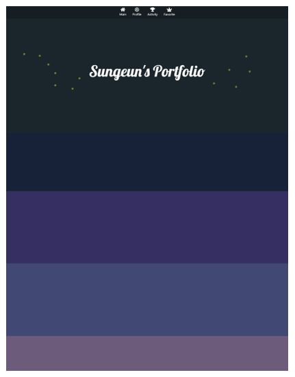
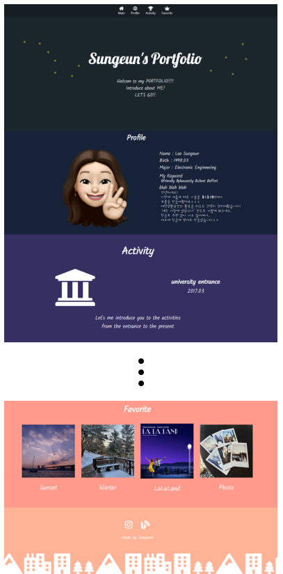
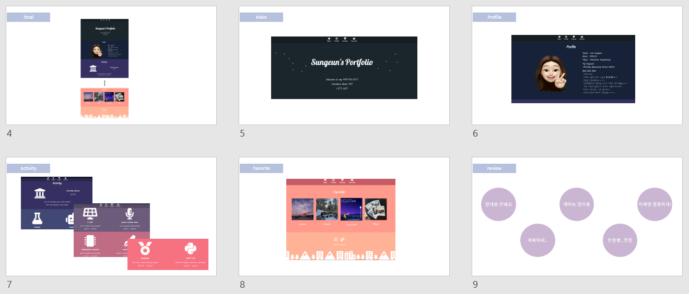

[SE_portfolio](https://lsee9.github.io/SE_portfolio/) 👈 완성페이지
 
> 완전한 제작파일은 [master branch](https://github.com/lsee9/SE_portfolio/tree/master)에!!

# SE_portfolio
 
일주일의 포트폴리오 제작 프로젝트!

## Introduction
> 프로젝트 시작 배경을 적어볼게요!
- 일주일간의 학습
  - `HTML`, `CSS`, `Bootstrap`을 배우고 프로젝트를 수행했습니다
  - 재밌지만 어려운, 마음대로 되는게 없는 일주일이었습니다
- __설날에 놀면 뭐하니?!__
  - 열정가득 조장님!!:fire:
  - 코앞으로 다가온 설날! 뭐라도 해보지 않겠나?
  - 그렇게 우리의 __포트폴리오 프로젝트__ 가 시작되었습니다!
  
## Goal
> 일주일 프로젝트의 목표는??
- 02/08 ~ 02/14까지 나를 소개하는 포트폴리오 웹사이트 제작하기!
- HTML, CSS, Bootstrap에 익숙해지기

## Plan
> 계획이 있어야겠죠?? 
> 넘나 빡세지만...화이팅!
  - 02/08(Mon) : 포트폴리오 초안 제작 및 공유
  - 02/09(Tue) : 전체 구조 잡기
  - 02/10(Wed) : 사진 및 전체적인 내용 구성하기
  - 02/11(Thu) : 중간점검
  - 02/12(Fri) : 깔끔하게 디자인하기
  - 02/13(Sat) : 세부사항 조정(90%완성 목표!)
  - 02/14(Sun) : 최종결과 소개

## 02/08 진행상황
> 오늘은 초안을 구성하고 스터디원들과 공유하는 시간을 가졌습니다!
- 초안

  
  - main page : 인사말(나는 누구일까요?), 뒷모습 이모지(클릭하면 프로필로?)
  - profile : 앞모습 이모지, 이름, 나이 등등 나에 대한 기본적인 정보
  - activity : 봉사, 인턴, 대회 등등 지난 4년간의 활동 순차적으로 정리
  - favorite : 나의 흥미, 좋아하는 사진, 영화 등등 간략하게 볼 수 있는 페이지
- 간단하게 구성해봤습니다!
- 스터디원 다들 넘나 멋지게 기획해서 지지않으려면 열심히 해야겠죠??ㅎㅎㅎ

## 02/09 진행상황
> 전체적인 구조를 잡기로 계획했습니다! 그렇지만...실상은..?
- 구성한 페이지

  
  - nav바
    - 조장님이 소개해주신 font awesome의 아이콘활용!
    - d-flex를 이용한 구조잡기
  - profile 간단 구성
    - grid를 이용한 사진과 글자배치
  - activity 색상 구성
    - color hunt(조장님 짱ㅎㅎㅎ)의 색상 활용! :city_sunset: 해질녘 색이 변하는 하늘...좋아!!
    - css 클래스이용
- 일단 시도라도 해봤습니다!!!
- 뭐 많이 한 건 없지만... 일단은 패스!

## 02/10 진행상황
> 전체적인 구성을 뒤엎을까 고민하기 시작하는데....
- 원래는 여러페이지를 만들고 싶었는데!
- 갑자기 __한페이지 구성이 멋져보인다..?!!?!__
- 뭐가 좋을 지 넘나 고민 중 :sob:

## 02/11 진행상황
> 10일과 11일에 걸친 여러시도! 결국 전체적인 구성을 결정했습니다!
- bootstrap의 scrollspy로 결정하고 구성하고 디테일 잡다가 시간날리고...
- 다시 맘에 안들어서 또 구성바꿔서 시간날리고...
- 아니 분명 잡고있던 시간은 긴데 자꾸 엎어서 뭐 한게 없다!!!!
- 최종 전체 구성

  

  - nav를 fixed top으로 고정시키고 투명하게 해서 페이지 위에 보이도록 구성
  - 각 버튼을 누르면 해당 위치로 이동하도록 만듦!
  - google font를 활용해 font 수정
- 10, 11일에 걸친 결과물이 이거...ㅎㅎㅎㅎ
- 느림보다운 결과였다
- 그렇지만 시도한것 중에 그나마 제일 맘에 드는 구성이니까 이걸로 위안 삼아야지 :joy:

## 02/12 진행상황
> 오늘은 뭘 좀 많이 했을까요?? 사실 전 기대가 안돼요!
- 디스코드를 이용한 소통!
  - __설날에도 열일__ 하는 우리 조장님과 팀원분들 :fire:
  - '팀원'들을 두 가지 새로운 기술을 습득했다!!
    - SEO - metatag : 공유했을때 표시되는 사진과 제목, 설명 구성!
    - favicon : 웹페이지 옆에 뜨는 이미지? 조정!
- 내 포트폴리오의 행방은..?
  - profile과 activity구성!
  - 이정도면 거의 다 한거지만... 세부적인 조정이 너무 어렵다
  - 또 아직 화면 작아지는 것에대한 조정은 못한상태..!
- 조급해하지 말라고했으니까...ㅎㅎㅎ 나도 모르겠다아

## 02/13 진행상황
> 오늘 다 끝냈어야하는데ㅎㅎㅎ 과연 결과는...?
- 어김없이 돌아온 소통시간!(23시!!)
  - XML-sitemap.com : 검색엔진에서 내 웹사이트가 앞에 뜰 수 있도록? 하는 거라고 해요!
    - 웹페이지 주소 올리고 sitemap.xml 받기
    - 내 페이지 있는 깃 위치에 옮기고 푸쉬하면 OK!
    - 페이지가 추가되면 다시 갱신해줍시다!(지도 수정하는 느낌/단순 수정은 갱신nono)
  - google search console : 페이지가 내것인지 확인하는..? 방문자수같은 정보 제공해준데요!
    - 속성추가 -> 내 웹페이지 추가 -> 소유권확인 페이지 -> HTML태그 index에 붙이고 푸쉬!
    - 그러면 내 페이지에대한 소유권이 확인된 것이라고 합니당ㅎㅎㅎ
    - sitemap -> sitemap.xml 제출해서 성공 뜨면 OK(안돼도뭐... 모르겠다..헿)
- 포폴 결과!! 두구두구두구 :drum:
  - 전체 페이지를 완성하긴 했다!
  
  
  
  - 근데 media query 적용이 안되네..? 하핳ㅎ
  - 14일 22시가 발표인데에ㅔ 흐규우 :sob:
  - 일요일 낮에 해봐야지...

## 02/14 진행상황
> 프로젝트 마지막날!!! 최종 발표까지 완수했습니다!!
- 오늘의 포폴 마무리!!
  - media query문제 : 약간 컴을 오래 켜논 문제 + min, max 제대로 설정 안한 것!
    - 다행히 여러 시도 끝에 성공...!
  - 다른 문제...!! : 모바일 같은데서 생각보다 너무 깨진다ㅜㅜㅜ
    - 계속 왔다갔다 확인하고 커밋하면서 한참 수정했다..
    - col 바꾸고, 미디어쿼리로 글자 크기 바꾸고...힘들다아ㅜ
  - 발표를 위한 ppt도 간단하게 만들었다!
  
  
  
- 최종 발표
  - 22시에 조원들과 최종 발표 시간을 가졌다
  - 다들 아주 잘해...멋져
  - 나는 발표하는데 화면공유가 안되서 애를 좀 먹었지만... 어쨌든 끝!!
  - 홀가분 하기도하고 아쉽기도 하다
  - 조장님의 특별 보너스 :coffee: 
    - README를 남겨준 사람들에게 제공해주셨다!!
    - 오예! 선물은 역시 받으면 기쁘다
- 내 소감을 말해보자면...
  - 재미는 있었다!
    - 그래도 내걸 직접 만들어본다는 것! 그게 너무 좋았다
  - 그치만 진짜 힘들었다
    - 약간 내가 오기 부린것도 있지만...
    - 맘대로 안되는 것도 많구 세세하게 신경쓰면 끝이 없어서 힘들었다ㅜ
    - 또 잘 안되면 붙잡고 늘어지는 성격때문에 시간도 쏟아 부었다ㅜㅜ
    - 그렇게 다른 공부따위.. ~~개나 줘버리라지..~~
  - 그래도 역시 보람은 있다
    - 뭘 만들고 결과물이 있는게 재밌다!! ~~짜릿해! 즐거워!!!~~
    - 이래서 SW를 선택한 것도 있다는건 안비밀..ㅎㅎ
- 조장님도 떠나시구... 진짜 시원 섭섭하다ㅜ
- 어쨌든 좋은 프로젝트였던건 확실한 사실!!
- 다음엔 나 혼자라도 뭔가 만들어봐야겠다

## 02/15 추가 수정
> 언니랑 엄마한테 자랑했는데...약간 문제가..??!?
- 최종 발표 끝나고 바로 자랑했다! (이런건 자랑해야지!!ㅋㅋㅋ)
- 그런데 이게뭐람... 아이폰 화면 크기 무엇..?
  - 내 삼성폰으로 볼때는 얼추 맞아서 마무리 했는데
  - 아이폰으로 보니까 글자 삐져 나가구...맨 마지막줄은 왜 잘 안보이는데ㅔ!!
  - 기종마다 화면 차이가 있다는게 실감갔다
  - 또 패드로 보니까...오마이갓... __총체적난국이다__
  - 이건 사실 수정할 생각은 못하겠다... __그 다양한 디바이스를 맞출 자신이 난 아직없다...__ :sob:
  - 그래도 나중에 실력을 더 쌓는다면 진짜 완벽하게 만들고싶다!!! (다른 사람들 진짜 대단..ㅜ 존경스럽다ㅜ)
- 구글 검색시 이름
  - 내가 안바꿔가지구... 이름이 Document로 뜬다ㅋㅋㅋㅋ
  - 그래서 이정도는 수정하기로 했다!
- 많이 엉성하지만 어쨌든 프로젝트 끝!!!
- 다음엔 진짜 다른 프젝으로 돌아오겠습니당ㅎㅎㅎ
